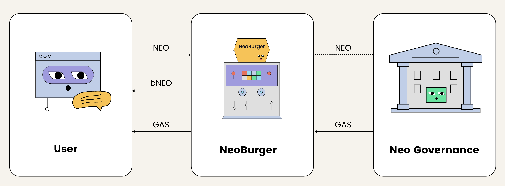

# NeoBurger Research

## Introduction



## Reference links
[NeoBurger Websiste](https://neoburger.io/en/home/)
[NeoBurger Github Repo](https://github.com/neoburger)


### **Technical Report on NeoBurger: A Deep Dive for Blockchain Developers**

#### **Introduction**
NeoBurger introduces a sophisticated approach to maximizing the utility and rewards associated with NEO token staking through governance, using the NEP-17 token, **bNEO**. bNEO is designed as a divisible counterpart to NEO, with 8 decimals, and functions as a liquidity and reward optimization tool. This report outlines the technical components of NeoBurger, including its smart contract architecture, reward mechanisms, and security provisions. The emphasis is placed on the **code-level** operations of the platform, integrating insights from the project’s source code and advanced governance strategies.

---

### **Smart Contract Architecture**
NeoBurger’s core functionality revolves around the **BurgerNEO** contract, implemented using the NEP-17 token standard. Below, the most critical sections of the code are explored:

1. Token Logic**:
* Decimals and Symbol**:
     ```csharp
     public override byte Decimals() => 8;
     public override string Symbol() => "bNEO";
     ```
     The token follows the NEP-17 standard, with 8 decimals to provide greater flexibility for users when transacting fractions of NEO, a crucial feature given NEO's indivisibility.

2. Minting and Burning Mechanism**:
   The smart contract allows users to mint **bNEO** by transferring **NEO** to the contract address. The minting mechanism adjusts bNEO balances according to the input NEO amount, and the corresponding GAS rewards are optimized through NeoBurger’s **strategic voting** mechanism.

* Minting Process**:
     ```csharp
     if (Runtime.CallingScriptHash == NEO.Hash)
     {
         ExecutionEngine.Assert(NEO.Transfer(Runtime.ExecutingScriptHash, Agent(0), NEO.BalanceOf(Runtime.ExecutingScriptHash)));
         Mint(from, amount * 100000000);
     }
     ```

     When users send NEO to the contract, it invokes a mint operation, where the contract transfers the user's NEO to one of NeoBurger’s **agents**, and mints the equivalent amount of bNEO, maintaining a 1:1 ratio.

* Burning Process**:
     ```csharp
     if (Runtime.CallingScriptHash == GAS.Hash && amount > 0 && data is null)
     {
         amount *= DEFAULTWITHDRAWFACTOR;
         Burn(from, amount);
         amount /= 100000000;
         for (BigInteger i = 0; amount > 0; i++)
         {
             UInt160 agent = Agent(i);
             BigInteger balance = NEO.BalanceOf(agent) - 1;
             if (amount > balance)
             {
                 amount -= balance;
                 Contract.Call(agent, "transfer", CallFlags.All, new object[] { from, balance });
             }
             else
             {
                 Contract.Call(agent, "transfer", CallFlags.All, new object[] { from, amount });
                 break;
             }
         }
     }
     ```
     The burning process redistributes NEO back to the users when they redeem their bNEO, deducting a **0.001 GAS withdrawal fee per NEO**.

---

### **Governance Mechanism**
NeoBurger’s governance model hinges on the participation of its agents in **NEO Governance**. **bNEO holders** indirectly delegate their voting power to NeoBurger, which optimizes GAS rewards based on the voting strategy. This strategy dynamically adjusts voting positions, aiming to maximize the GAS return for bNEO holders.

- **Voting Strategy and Reward Calculation**:
   - NeoBurger utilizes multiple agents (BurgerAgent0, BurgerAgent1, etc.), and distributes users’ NEO across these agents to participate in voting.
   - The reward to each user is calculated using the **Reward Per Token Stored (RPS)** value:
     ```csharp
     BigInteger reward = balance * (rps - paid) / 100000000 + reward;
     new StorageMap(Storage.CurrentContext, PREFIXREWARD).Put(account, earned);
     ```

     This formula computes the reward based on the difference between the current RPS and the last paid value for the user, ensuring that GAS rewards are distributed fairly based on each user's bNEO balance.

---

### **Fee Structure**

- **Performance Fee**:
  NeoBurger charges a **1% performance fee** on GAS rewards, which is automatically sent to the project’s **treasury**. This is essential for the project’s sustainability and incentivizes the strategic adjustment of voting positions.

  ```csharp
  public static void Pika(BigInteger amount)
  {
      ExecutionEngine.Assert(Runtime.CheckWitness(Owner()));
      ExecutionEngine.Assert(GAS.Transfer(Runtime.ExecutingScriptHash, Owner(), amount));
  }
  ```

- **Withdrawal Fee**:
  To prevent malicious behavior such as **GAS farming**, NeoBurger imposes a **0.001 GAS fee per NEO** withdrawn. This fee discourages users from depositing large amounts of NEO before reward distributions and immediately withdrawing after. The formula that governs the profit calculation for such an exploit is:

  \[
  P = G \cdot \frac{X}{X + T} - X \cdot F \cdot \frac{T}{X + T}
  \]

  Where:
  - \( P \) is the profit,
  - \( G \) is the GAS reward,
  - \( X \) is the NEO deposited by the attacker,
  - \( T \) is the total NEO deposited by others,
  - \( F \) is the withdrawal fee factor.

  This formula ensures that if **G < F \cdot T**, the attacker’s profit becomes negative, thus discouraging such attacks.

---

### **Strategic Management**

NeoBurger employs a **strategist role** to manage voting and reward distribution dynamically. This strategist is restricted by a candidate whitelist to ensure the security of the **dBFT consensus mechanism** in the Neo network.

- **Whitelisting of Candidates**:
  ```csharp
  public static void AllowCandidate(ECPoint target)
  {
      ExecutionEngine.Assert(Runtime.CheckWitness(Owner()));
      StorageMap candidates = new StorageMap(Storage.CurrentContext, PREFIXCANDIDATEWHITELIST);
      candidates.Put(target, 1);
  }
  ```

  The whitelist ensures that only pre-approved candidates can be voted for, protecting the network from **Sybil attacks** or malicious actors gaining voting power through NeoBurger.

---

### **Conclusion**
NeoBurger offers a highly technical and well-optimized solution for NEO holders, allowing them to maximize their GAS rewards through delegated governance participation. The smart contracts employ advanced NEP-17 token logic, and security measures such as **whitelisting** and **withdrawal fees** are implemented to ensure the integrity and profitability of the system. The strategic voting and redistribution mechanisms ensure that GAS rewards are optimized, and malicious behavior is mitigated through mathematical safeguards.

This report provides all the necessary details for a senior blockchain developer to get started with NeoBurger, including key formulas, processes, and governance strategies. All related smart contract code is available in the [NeoBurger GitHub repository](https://github.com/neoburger/code.git). 

For further customization and deployment, developers are encouraged to explore the codebase, adapt voting strategies, and engage in Neo governance via NeoBurger’s DAO framework.


