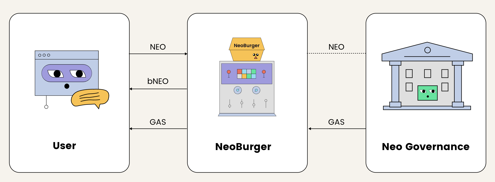

# Technical Report on NeoBurger

## Introduction
NeoBurger introduces a sophisticated approach to maximizing the utility and rewards associated with NEO token staking through governance, using the NEP-17 token, **bNEO**. bNEO is designed as a divisible counterpart to NEO, with 8 decimals, and functions as a liquidity and reward optimization tool. This report outlines the technical components of NeoBurger, including its smart contract architecture, reward mechanisms, and security provisions. The emphasis is placed on the **code-level** operations of the platform, integrating insights from the project’s source code and advanced governance strategies.




## Reference links
* [NeoBurger Websiste](https://neoburger.io/en/home/)

* [NeoBurger Github Repo](https://github.com/neoburger)


## Technical Details
### Smart Contract Architecture
NeoBurger’s core functionality revolves around the **BurgerNEO** contract, implemented using the NEP-17 token standard. Below, the most critical sections of the code are explored:

1. **Token Logic**
* Decimals and Symbol
     ```csharp
     public override byte Decimals() => 8;
     public override string Symbol() => "bNEO";
     ```
     The token follows the NEP-17 standard, with 8 decimals to provide greater flexibility for users when transacting fractions of NEO, a crucial feature given NEO's indivisibility.

2. **Minting and Burning Mechanism**
   The smart contract allows users to mint **bNEO** by transferring **NEO** to the contract address. The minting mechanism adjusts bNEO balances according to the input NEO amount, and the corresponding GAS rewards are optimized through NeoBurger’s **strategic voting** mechanism.

* Minting Process
     ```csharp
     if (Runtime.CallingScriptHash == NEO.Hash)
     {
         ExecutionEngine.Assert(NEO.Transfer(Runtime.ExecutingScriptHash, Agent(0), NEO.BalanceOf(Runtime.ExecutingScriptHash)));
         Mint(from, amount * 100000000);
     }
     ```

     When users send NEO to the contract, it invokes a mint operation, where the contract transfers the user's NEO to one of NeoBurger’s **agents**, and mints the equivalent amount of bNEO, maintaining a 1:1 ratio.

* Burning Process
     ```csharp
     if (Runtime.CallingScriptHash == GAS.Hash && amount > 0 && data is null)
     {
         amount *= DEFAULTWITHDRAWFACTOR;
         Burn(from, amount);
         amount /= 100000000;
         for (BigInteger i = 0; amount > 0; i++)
         {
             UInt160 agent = Agent(i);
             BigInteger balance = NEO.BalanceOf(agent) - 1;
             if (amount > balance)
             {
                 amount -= balance;
                 Contract.Call(agent, "transfer", CallFlags.All, new object[] { from, balance });
             }
             else
             {
                 Contract.Call(agent, "transfer", CallFlags.All, new object[] { from, amount });
                 break;
             }
         }
     }
     ```
     The burning process redistributes NEO back to the users when they redeem their bNEO, deducting a **0.001 GAS withdrawal fee per NEO**.

---

### **Governance Mechanism**
NeoBurger’s governance model hinges on the participation of its agents in **NEO Governance**. **bNEO holders** indirectly delegate their voting power to NeoBurger, which optimizes GAS rewards based on the voting strategy. This strategy dynamically adjusts voting positions, aiming to maximize the GAS return for bNEO holders.

1. **Voting Strategy and Reward Calculation**:
- NeoBurger utilizes multiple agents (BurgerAgent0, BurgerAgent1, etc.), and distributes users’ NEO across these agents to participate in voting.
- The reward to each user is calculated using the **Reward Per Token Stored (RPS)** value:
     ```csharp
     BigInteger reward = balance * (rps - paid) / 100000000 + reward;
     new StorageMap(Storage.CurrentContext, PREFIXREWARD).Put(account, earned);
     ```

     This formula computes the reward based on the difference between the current RPS and the last paid value for the user, ensuring that GAS rewards are distributed fairly based on each user's bNEO balance.

---

### **Fee Structure**

1. **Performance Fee**:
  NeoBurger charges a **1% performance fee** on GAS rewards, which is automatically sent to the project’s **treasury**. This is essential for the project’s sustainability and incentivizes the strategic adjustment of voting positions.

  ```csharp
  public static void Pika(BigInteger amount)
  {
      ExecutionEngine.Assert(Runtime.CheckWitness(Owner()));
      ExecutionEngine.Assert(GAS.Transfer(Runtime.ExecutingScriptHash, Owner(), amount));
  }
  ```
2. **Withdrawal Fee**:
  To prevent malicious behavior such as **GAS farming**, NeoBurger imposes a **0.001 GAS fee per NEO** withdrawn. This fee discourages users from depositing large amounts of NEO before reward distributions and immediately withdrawing after. The formula that governs the profit calculation for such an exploit is: $P = G \cdot \frac{X}{X + T} - X \cdot F \cdot \frac{T}{X + T}$

  Where:
  - \( P \) is the profit,
  - \( G \) is the GAS reward,
  - \( X \) is the NEO deposited by the attacker,
  - \( T \) is the total NEO deposited by others,
  - \( F \) is the withdrawal fee factor.

  This formula ensures that if **G < F \cdot T**, the attacker’s profit becomes negative, thus discouraging such attacks.

---

### **Strategic Management**

NeoBurger employs a **strategist role** to manage voting and reward distribution dynamically. This strategist is restricted by a candidate whitelist to ensure the security of the **dBFT consensus mechanism** in the Neo network.

- **Whitelisting of Candidates**:
  ```csharp
  public static void AllowCandidate(ECPoint target)
  {
      ExecutionEngine.Assert(Runtime.CheckWitness(Owner()));
      StorageMap candidates = new StorageMap(Storage.CurrentContext, PREFIXCANDIDATEWHITELIST);
      candidates.Put(target, 1);
  }
  ```

  The whitelist ensures that only pre-approved candidates can be voted for, protecting the network from **Sybil attacks** or malicious actors gaining voting power through NeoBurger.

---

### **Conclusion**

All related smart contract code is available in the [NeoBurger GitHub repository](https://github.com/neoburger/code.git). 


Strategy official document:

NeoBurger Public Strategy
Neo was founded 2014 and has grown into a first-class smart contract platform. It is backed by a global developer community who continue to drive the blockchain forward. more

The N3 version of the Neo MainNet launched at 9:00:00 on August 2nd, 2021 (UTC). more

Neo is unique in that it was the first public blockchain platform to adopt a dual token mechanism (NEO and GAS). It separates the rights of governance from the rights of using the network. It also provides a means of acquiring the tokens needing to pay transaction fees. more

NEO token holders decide who is in charge of maintaining the Neo network through the election of a Neo Council. GAS token rewards are distributed to voters and council members alike. more

The Introduction
NeoBurger project seeks to compensate for the usability issues of indivisible NEO in applications such as DeFi, while also providing an avenue for maximized GAS rewards for holders. more

NeoBurger earns the majority of its GAS by voting in the Neo N3 governance mechanism. NEO pooled in the NeoBurger contract is automatically managed using different voting strategies. NEO is distributed between a limited number of “agents,” each of which can cast a vote. By using multiple agents as separate wallets, NeoBurger can get around the limitation of only being able to vote for one candidate at a time.

Constant management of votes between the agents allows the NeoBurger platform to maximize the GAS received from the vote reward distribution. The majority of these rewards are passed on to bNEO holders, although some fees do also apply to certain actions. As more NEO is pooled in NeoBurger, the platform can employ further strategies, for example to use its increased vote weight to help elect new nodes to the council.

In this article, the NeoBurger strategy of a simplified governance mechanism of Neo network is introduced.

Native Governance Reward Mechanism
Everyone can burn 1000 GAS and become a candidate.

Every NEO holder can vote for a candidate and the voting weight is its NEO balance. Votes can be changed or canceled by the NEO holder.

The Top 7 voted candidates are elected as consensus nodes and the Top 21 voted candidates are elected as council members.

There are 5 GAS generated in each block: 40% of the GAS are split equally among the 7 voter groups of consensus nodes and 40% of the GAS are split equally among the 14 voter groups of non-consensus-nodes council members. Inside each group, the GAS is distributed to the voters by their NEO balances.

In this article, the reward coefficient is defined as the GAS distributed to each voter group.

NeoBurger can distribute its NEO to the controlled agents who vote for different specific candidates.

We want to solve the optimal NEO distribution.

Limitations of the Strategy
In this article:

amount of NEO is a positive real number instead of a positive integer while NEO is an indivisible token;
reward coefficients are constants while actually they can be changed by moving candidate’s rank up or down; (actually moving candidates into or out from consensus nodes or council members is a dangerous operation for the entire network if the candidates are not prepared well)


## The Problem

**Given**:

- \( \mathcal{C} \): a set of candidates
- \( v_c \in \mathbb{R}_{>0} \): the votes of each candidate \( c \in \mathcal{C} \)
- \( k_c \in \mathbb{R}_{>0} \): the reward coefficient of each candidate \( c \in \mathcal{C} \)
- \( n \in \mathbb{R}_{>0} \): the total amount of **NEO** we hold

**Solve the amount of NEO** \( n_c \in \mathbb{R}_{\geq 0} \) we vote to each candidate \( c \in \mathcal{C} \):

- Satisfying \( \sum_{c \in \mathcal{C}} n_c = n \)
- Maximizing the following **GAS** reward expression:

\[
f = \sum_{c \in \mathcal{C}} \frac{n_c k_c}{v_c + n_c} \in \mathbb{R}_{>0}
\]


The Metric
• time complexity
• space complexity


## The Solution

Define the solution as a mapping \( \Psi_c : \mathcal{C} \to \mathbb{R}_{\geq 0} \)

1. calculate \( n_* \):

   \[
   n_* = \sum_{c \in \mathcal{C}} v_c
   \]

2. calculate \( u \):

   \[
   u = \frac{n + n_*}{\sum_{c \in \mathcal{C}} \sqrt{k_c v_c}}
   \]

3. for \( \forall c \in \mathcal{C} \):

   \[
   n_c = u \sqrt{k_c v_c} - v_c
   \]

4. define \( \mathcal{C}_+ \):

   \[
   \mathcal{C}_+ = \{ c | c \in \mathcal{C}, n_c \geq 0 \}
   \]

5. return a mapping \( \Psi_c \):

   \[
   \Psi_c(c) = 
   \begin{cases}
   0 & c \notin \mathcal{C}_+ \\
   n_c & \mathcal{C}_+ = \mathcal{C} \\
   \Psi_{\mathcal{C}_+}(c) & \text{else}
   \end{cases}
   \]

## The Analysis

Proof of Correctness and complexity will be explained in this section.

### Correctness

Follow the **method of Lagrange multipliers**:

In order to find the maximum of function \( f \) subjected to the equality constraint \( g = n - \sum_{c \in \mathcal{C}} n_c = 0 \), form the Lagrangian function:

\[
\Lambda = f - \lambda g
\]

The necessary condition for the optimality can be inferred by solving the following equation:

\[
\nabla \Lambda = 0
\]


Thus for \( \forall c \in \mathcal{C} \):

\[
\frac{\partial \Lambda}{\partial n_c} = - \frac{k_c v_c}{(v_c + n_c)^2} - \lambda = 0
\]

Thus for \( \forall c_i, c_j \in \mathcal{C} \):

\[
\frac{k_c v_{c_i}}{(v_{c_i} + n_{c_i})^2} = \frac{k_c v_{c_j}}{(v_{c_j} + n_{c_j})^2}
\]

Thus for \( \forall c_i, c_j \in \mathcal{C} \):

\[
\frac{n_{c_i} + v_{c_i}}{\sqrt{k_c v_{c_i}}} = \frac{n_{c_j} + v_{c_j}}{\sqrt{k_c v_{c_j}}}
\]

For \( \forall c \in \mathcal{C} \): let \( u = \frac{n_c + v_c}{\sqrt{k_c v_c}} \), then:

\[
\sum_{c \in \mathcal{C}} u \sqrt{k_c v_c} = \sum_{c \in \mathcal{C}} n_c + v_c = n + n_*
\]

Thus:

\[
u = \frac{n + n_*}{\sum_{c \in \mathcal{C}} \sqrt{k_c v_c}}
\]

Thus:

\[
n_c = u \sqrt{k_c v_c} - v_c
\]

Sufficient conditions for a constrained local maximum can be stated in terms of a sequence of principal minors (determinants of upper-left-justified sub-matrices) of the **bordered Hessian matrix** of second derivatives of the Lagrangian expression.

\[
\mathbf{H}(\Lambda) = \begin{bmatrix}
\frac{\partial^2 \Lambda}{\partial \lambda^2} & \frac{\partial^2 \Lambda}{\partial \lambda \partial n_{c_1}} & \frac{\partial^2 \Lambda}{\partial \lambda \partial n_{c_2}} & \frac{\partial^2 \Lambda}{\partial \lambda \partial n_{c_3}} & \cdots & \frac{\partial^2 \Lambda}{\partial \lambda \partial n_{c_{|\mathcal{C}|}}} \\
\frac{\partial^2 \Lambda}{\partial n_{c_1} \partial \lambda} & \frac{\partial^2 \Lambda}{\partial n_{c_1}^2} & \frac{\partial^2 \Lambda}{\partial n_{c_1} \partial n_{c_2}} & \frac{\partial^2 \Lambda}{\partial n_{c_1} \partial n_{c_3}} & \cdots & \frac{\partial^2 \Lambda}{\partial n_{c_1} \partial n_{c_{|\mathcal{C}|}}} \\
\frac{\partial^2 \Lambda}{\partial n_{c_2} \partial \lambda} & \frac{\partial^2 \Lambda}{\partial n_{c_2} \partial n_{c_1}} & \frac{\partial^2 \Lambda}{\partial n_{c_2}^2} & \frac{\partial^2 \Lambda}{\partial n_{c_2} \partial n_{c_3}} & \cdots & \frac{\partial^2 \Lambda}{\partial n_{c_2} \partial n_{c_{|\mathcal{C}|}}} \\
\frac{\partial^2 \Lambda}{\partial n_{c_3} \partial \lambda} & \frac{\partial^2 \Lambda}{\partial n_{c_3} \partial n_{c_1}} & \frac{\partial^2 \Lambda}{\partial n_{c_3} \partial n_{c_2}} & \frac{\partial^2 \Lambda}{\partial n_{c_3}^2} & \cdots & \frac{\partial^2 \Lambda}{\partial n_{c_3} \partial n_{c_{|\mathcal{C}|}}} \\
\vdots & \vdots & \vdots & \vdots & \ddots & \vdots \\
\frac{\partial^2 \Lambda}{\partial n_{c_{|\mathcal{C}|}} \partial \lambda} & \frac{\partial^2 \Lambda}{\partial n_{c_{|\mathcal{C}|}} \partial n_{c_1}} & \frac{\partial^2 \Lambda}{\partial n_{c_{|\mathcal{C}|}} \partial n_{c_2}} & \frac{\partial^2 \Lambda}{\partial n_{c_{|\mathcal{C}|}} \partial n_{c_3}} & \cdots & \frac{\partial^2 \Lambda}{\partial n_{c_{|\mathcal{C}|}}^2}
\end{bmatrix}
\]
Then:

\[
\mathbf{H}(\Lambda) = \begin{bmatrix}
0 & -1 & -1 & -1 & \cdots & -1 \\
-1 & -\frac{2k_{c_1} v_{c_1}}{(v_{c_1} + n_{c_1})^3} & -1 & -1 & \cdots & -1 \\
-1 & -1 & -\frac{2k_{c_2} v_{c_2}}{(v_{c_2} + n_{c_2})^3} & -1 & \cdots & -1 \\
-1 & -1 & -1 & -\frac{2k_{c_3} v_{c_3}}{(v_{c_3} + n_{c_3})^3} & \cdots & -1 \\
\vdots & \vdots & \vdots & \vdots & \ddots & \vdots \\
-1 & -1 & -1 & -1 & \cdots & -\frac{2k_{c_{|\mathcal{C}|}} v_{c_{|\mathcal{C}|}}}{(v_{c_{|\mathcal{C}|}} + n_{c_{|\mathcal{C}|}})^3}
\end{bmatrix}
\]

For \( i \leq |\mathcal{C}| \in \mathbb{N}_+ \), the \( i \)-th upper-left-justified sub-matrices is:

\[
\mathbf{h}_i = \begin{bmatrix}
0 & -1 & -1 & -1 & \cdots & -1 \\
-1 & -\frac{2k_{c_1} v_{c_1}}{(v_{c_1} + n_{c_1})^3} & -1 & -1 & \cdots & -1 \\
-1 & -1 & -\frac{2k_{c_2} v_{c_2}}{(v_{c_2} + n_{c_2})^3} & -1 & \cdots & -1 \\
-1 & -1 & -1 & -\frac{2k_{c_3} v_{c_3}}{(v_{c_3} + n_{c_3})^3} & \cdots & -1 \\
\vdots & \vdots & \vdots & \vdots & \ddots & \vdots \\
-1 & -1 & -1 & -1 & \cdots & -\frac{2k_{c_i} v_{c_i}}{(v_{c_i} + n_{c_i})^3}
\end{bmatrix}
\]

Follow the **Leibniz formula** for determinants:

\[
\det(\mathbf{h}_i) = \sum_{1 \leq t \leq i} (-1)(-1)^2 \prod_{1 \leq s \leq i, s \neq t} \left( -\frac{2k_{c_s} v_{c_s}}{(v_{c_s} + n_{c_s})^3} \right)
\]

Thus:

\[
\text{sign}(\det(\mathbf{h}_i)) = \text{sign} \left( \sum_{1 \leq t \leq i} (-1)^i \right) = (-1)^i
\]

Thus it is a local maximum of function \( f \).

Since the Hessian matrix shows \( f \) is an upper convex function whose local maximum is also a global maximum, our solution is the global maximum.

The only issue left is that sometimes \( \exists c \in \mathcal{C}, n_c < 0 \).

Define \( \mathcal{C}_- \):

\[
\mathcal{C}_- = \{ c | c \in \mathcal{C}, n_c < 0 \}
\]
to satisfy \( \forall c \in \mathcal{C} : n_c \geq 0 \), we let:

\[
\forall c \in \mathcal{C}_- : n_c = 0
\]

Otherwise, \( f \) is never maximum because:

\[
\max f | \exists c \in \mathcal{C}_- : n_c > 0 < \max f | \forall c \in \mathcal{C}_- : n_c = 0
\]

Then re-calculate the rest.

### Time Complexity

\[
O(\|\mathcal{C}\|^2)
\]

### Space Complexity

\[
O(\|\mathcal{C}\|)
\]


