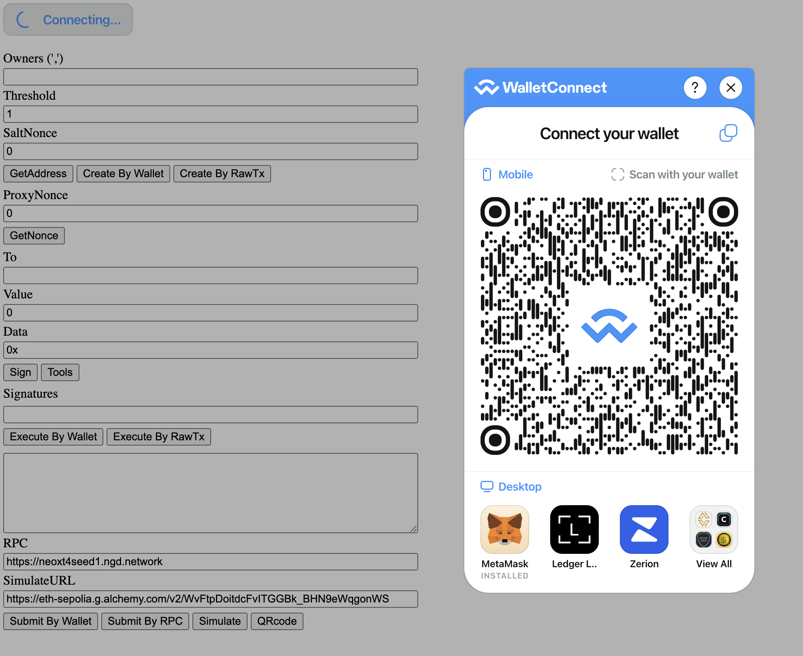
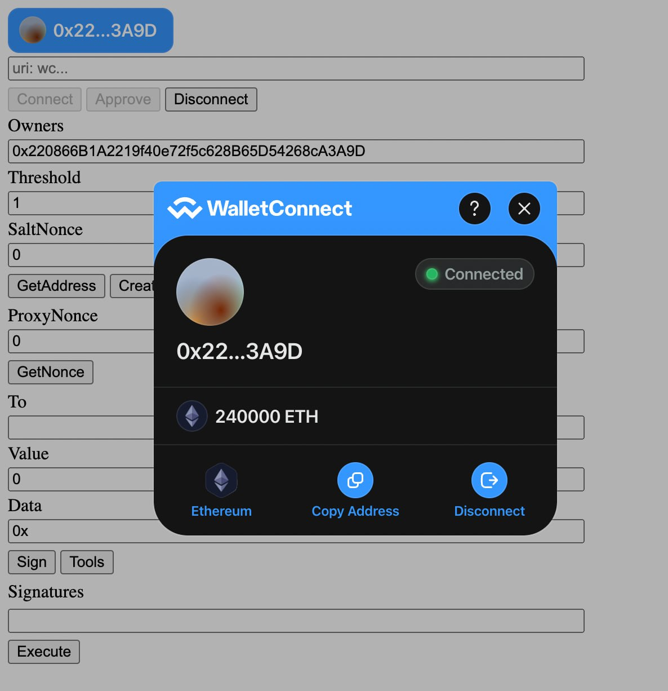

# Responsive Safe Wallet Interface

Siyi Xu, 26th Aug 2024

## Introduction

Ethereum smart contract wallet interface implemented using JavaScript, Ethers.js, and Web3Modal. It primarily utilizes Ethers.js for blockchain communication and Web3Modal for wallet connectivity. The code is designed to support multisig wallet functionalities, including wallet creation, transaction signing, and execution. Below is a technical breakdown of the key components and potential areas for enhancement.

## Code structure and Brief Review

|  |  |
| --------| --------------|

The code is structured into several parts:

* HTML Elements: Provides the user interface for interacting with the JavaScript functions.
* JavaScript Code: Implements the core functionality using Ethers.js and Web3Modal libraries.
* Utility Functions: Helper functions to facilitate interaction with the blockchain.
* Event Listeners: Functions triggered by user actions to perform blockchain operations.

### Specific features and implementations
#### The code uses SafeProxyFactory and SafeL2 contracts for deploying a proxy smart contract that acts as a multisig wallet. The createProxyWithNonce function is invoked to deploy this wallet using the factory pattern. This pattern is efficient and helps reduce gas costs by reusing deployed logic through proxies.

* potential improvements:
Gas Optimization: Consider leveraging more efficient opcodes or using Solidity's assembly for critical operations to further reduce gas consumption during deployment.

Security Enhancements: Implement checks within the proxy factory to ensure only authorized entities can deploy wallets. This prevents potential unauthorized or malicious wallet creations.


#### The code implements transaction handling using the execTransaction method, where transactions are signed and then sent to the multisig contract for execution. Signatures are collected and sorted using the sortSigs() function, which ensures proper ordering based on the owners' addresses.

* Potential Improvements:

Signature Security: Currently, signatures are collected and stored on the client side, which may expose them to potential risks if the client environment is compromised. Consider implementing a server-side component to handle signatures securely or using hardware wallets.

Batch Transaction Support: Introduce support for batch transactions to allow users to sign and execute multiple transactions in one go, improving efficiency.

(not necessary)
Responsive Design: The current interface is simplistic and could be made more responsive using CSS frameworks such as Bootstrap or Tailwind CSS, enhancing user experience across various devices.

#### makes use of a JsonRpcProvider for submitting raw transactions to the Ethereum network.


## Improvement and further function development

[Git Repo Link(for technical improvements)](https://zk524.github.io/safe/)


## Conclusion

The wallet interface code provides a solid foundation for managing multisig wallets on the Ethereum blockchain. However, there are several areas for technical improvement, particularly around security, user experience, and code maintainability. Implementing the suggested enhancements will not only optimize performance and security but also provide a more seamless experience for users.

## References

1. **Ethers.js Documentation**: [Ethers.js GitHub](https://github.com/ethers-io/ethers.js/)
2. **Web3Modal Documentation**: [Web3Modal GitHub](https://github.com/Web3Modal/web3modal)
3. **Solidity Gas Optimization Techniques**: [Solidity Documentation](https://docs.soliditylang.org/en/latest/internals/optimizations.html)
4. **Redux for State Management**: [Redux Official Site](https://redux.js.org/)
5. **Jest Testing Framework**: [Jest GitHub](https://github.com/facebook/jest)

# Responsive Safe Wallet Interface: An In-Depth Technical Analysis

**Author**: Siyi Xu  
**Date**: August 26, 2024

---

## Table of Contents

- [Responsive Safe Wallet Interface](#responsive-safe-wallet-interface)
  - [Introduction](#introduction)
  - [Code structure and Brief Review](#code-structure-and-brief-review)
    - [Specific features and implementations](#specific-features-and-implementations)
      - [The code uses SafeProxyFactory and SafeL2 contracts for deploying a proxy smart contract that acts as a multisig wallet. The createProxyWithNonce function is invoked to deploy this wallet using the factory pattern. This pattern is efficient and helps reduce gas costs by reusing deployed logic through proxies.](#the-code-uses-safeproxyfactory-and-safel2-contracts-for-deploying-a-proxy-smart-contract-that-acts-as-a-multisig-wallet-the-createproxywithnonce-function-is-invoked-to-deploy-this-wallet-using-the-factory-pattern-this-pattern-is-efficient-and-helps-reduce-gas-costs-by-reusing-deployed-logic-through-proxies)
      - [The code implements transaction handling using the execTransaction method, where transactions are signed and then sent to the multisig contract for execution. Signatures are collected and sorted using the sortSigs() function, which ensures proper ordering based on the owners' addresses.](#the-code-implements-transaction-handling-using-the-exectransaction-method-where-transactions-are-signed-and-then-sent-to-the-multisig-contract-for-execution-signatures-are-collected-and-sorted-using-the-sortsigs-function-which-ensures-proper-ordering-based-on-the-owners-addresses)
      - [makes use of a JsonRpcProvider for submitting raw transactions to the Ethereum network.](#makes-use-of-a-jsonrpcprovider-for-submitting-raw-transactions-to-the-ethereum-network)
  - [Improvement and further function development](#improvement-and-further-function-development)
  - [Conclusion](#conclusion)
  - [References](#references)
- [Responsive Safe Wallet Interface: An In-Depth Technical Analysis](#responsive-safe-wallet-interface-an-in-depth-technical-analysis)
  - [Table of Contents](#table-of-contents)
  - [Introduction](#introduction-1)
  - [Architecture Overview](#architecture-overview)
    - [Smart Contracts](#smart-contracts)
    - [Front-End Interface](#front-end-interface)
  - [Technical Implementation](#technical-implementation)
    - [Wallet Creation](#wallet-creation)
      - [SafeProxyFactory and SafeL2 Contracts](#safeproxyfactory-and-safel2-contracts)
      - [Factory Pattern and Proxy Deployment](#factory-pattern-and-proxy-deployment)
      - [Code Analysis](#code-analysis)
    - [Transaction Handling](#transaction-handling)
      - [Signature Collection and Management](#signature-collection-and-management)
      - [Transaction Execution via `execTransaction`](#transaction-execution-via-exectransaction)
      - [Signature Sorting with `sortSigs`](#signature-sorting-with-sortsigs)
      - [Code Analysis](#code-analysis-1)
    - [Blockchain Interaction](#blockchain-interaction)
      - [Ethers.js Integration](#ethersjs-integration)
      - [Web3Modal for Wallet Connectivity](#web3modal-for-wallet-connectivity)
      - [Raw Transaction Submission](#raw-transaction-submission)
  - [Potential Improvements](#potential-improvements)
    - [Gas Optimization](#gas-optimization)
      - [Leveraging Efficient Opcodes](#leveraging-efficient-opcodes)
      - [Optimizing Contract Code](#optimizing-contract-code)
    - [Security Enhancements](#security-enhancements)
      - [Authorization Checks in Proxy Factory](#authorization-checks-in-proxy-factory)
      - [Secure Signature Handling](#secure-signature-handling)
    - [Batch Transaction Support](#batch-transaction-support)
    - [Responsive Design Enhancements](#responsive-design-enhancements)
  - [Further Function Development](#further-function-development)
  - [Conclusion](#conclusion-1)
  - [References](#references-1)

---

## Introduction

The **Responsive Safe Wallet Interface** is an Ethereum smart contract wallet interface implemented using **JavaScript**, **Ethers.js**, and **Web3Modal**. It leverages Ethers.js for blockchain communication and Web3Modal for wallet connectivity, facilitating interactions with various wallet providers like MetaMask, WalletConnect, and others.

The interface supports multisignature (multisig) wallet functionalities, including:

- **Wallet Creation**: Deploying new multisig wallets using proxy contracts.
- **Transaction Signing**: Collecting signatures from multiple owners.
- **Transaction Execution**: Executing transactions once the required number of signatures is collected.

This technical analysis provides an in-depth examination of the key components, code structures, mathematical underpinnings, and potential areas for enhancement, aiming to assist senior blockchain developers and wallet developers in understanding and improving the implementation.

---

## Architecture Overview

### Smart Contracts

The wallet interface interacts with several key smart contracts:

1. **SafeProxyFactory**: A factory contract used to deploy proxy instances of the Safe (Gnosis Safe) contract.
2. **SafeL2**: The logic contract implementing the multisig wallet functionality.
3. **Proxy Contracts**: Deployed instances acting as individual multisig wallets for users.

**Factory Pattern**: The use of the factory pattern allows for efficient deployment of proxy contracts, reducing gas costs by reusing the logic contract.

### Front-End Interface

- **HTML Elements**: Provide the user interface components for interaction.
- **JavaScript Code**: Implements the core logic using Ethers.js and Web3Modal.
- **Utility Functions**: Facilitate interactions with smart contracts and manage data.
- **Event Listeners**: Handle user actions and trigger blockchain operations.

---

## Technical Implementation

### Wallet Creation

#### SafeProxyFactory and SafeL2 Contracts

The **SafeProxyFactory** contract's primary role is to deploy new proxy instances of the **SafeL2** contract, which contains the multisig wallet logic.

- **SafeL2**: Implements the multisig wallet functionality, including owner management, transaction execution, and signature verification.
- **SafeProxyFactory**: Provides the `createProxyWithNonce` function to deploy proxies with deterministic addresses.

#### Factory Pattern and Proxy Deployment

**Factory Pattern**:

- **Efficiency**: Deploying a single logic contract (**SafeL2**) and creating multiple proxy instances pointing to it saves gas.
- **Upgradeability**: Allows for upgrades to the logic contract without redeploying proxies.
- **Deterministic Addresses**: Using `createProxyWithNonce` ensures predictable proxy addresses based on the initialization parameters and nonce.

#### Code Analysis

**Smart Contract Interaction**:

```javascript
// Initialize contracts
const safeProxyFactory = new ethers.Contract(
  proxyFactoryAddress,
  SafeProxyFactoryABI,
  signer
);
const safeL2Singleton = new ethers.Contract(
  safeL2SingletonAddress,
  SafeL2ABI,
  signer
);

// Parameters for initialization
const initializer = safeL2Singleton.interface.encodeFunctionData('setup', [
  owners,
  threshold,
  // Additional parameters...
]);

// Create proxy with nonce
const tx = await safeProxyFactory.createProxyWithNonce(
  safeL2SingletonAddress,
  initializer,
  nonce
);
```

**Technical Details**:

- **Initializer Encoding**: Uses `encodeFunctionData` to prepare the initialization call for the proxy.
- **Nonce Usage**: Ensures unique deployment addresses and prevents replay attacks.
- **Gas Considerations**: Reusing the logic contract reduces deployment costs.

---

### Transaction Handling

#### Signature Collection and Management

**Signature Process**:

1. **Transaction Creation**: Prepare the transaction data, including to, value, data, operation, safeTxGas, etc.
2. **Hash Calculation**: Compute the transaction hash that needs to be signed by the owners.
   
   ```javascript
   const txHash = await safe.getTransactionHash(
     to,
     value,
     data,
     operation,
     safeTxGas,
     baseGas,
     gasPrice,
     gasToken,
     refundReceiver,
     nonce
   );
   ```

3. **Signature Generation**: Each owner signs the transaction hash.
   
   ```javascript
   const signature = await signer.signMessage(ethers.utils.arrayify(txHash));
   ```

4. **Signature Collection**: Collect signatures from all required owners.

#### Transaction Execution via `execTransaction`

**Execution Flow**:

- **Signature Aggregation**: Combine collected signatures into a single bytes array.
- **Transaction Execution**: Call `execTransaction` on the Safe contract with the aggregated signatures.

```javascript
const txResponse = await safe.execTransaction(
  to,
  value,
  data,
  operation,
  safeTxGas,
  baseGas,
  gasPrice,
  gasToken,
  refundReceiver,
  signatures
);
```

#### Signature Sorting with `sortSigs`

**Purpose**:

- The Safe contract requires signatures to be ordered by the signers' addresses to verify them efficiently.

**Implementation**:

```javascript
function sortSigs(signatures) {
  // Extract signer addresses from signatures
  const sigsWithAddress = signatures.map(sig => {
    const signerAddress = ethers.utils.verifyMessage(txHash, sig);
    return { sig, signerAddress };
  });

  // Sort signatures by signer address
  sigsWithAddress.sort((a, b) =>
    a.signerAddress.toLowerCase().localeCompare(b.signerAddress.toLowerCase())
  );

  // Concatenate sorted signatures
  const sortedSignatures = sigsWithAddress.map(s => s.sig).join('');
  return sortedSignatures;
}
```

**Technical Details**:

- **Signature Verification**: Uses `verifyMessage` to recover the signer's address.
- **Sorting Logic**: Orders signatures based on lexicographical order of addresses.
- **Concatenation**: Combines signatures into the format expected by the contract.

#### Code Analysis

- **Signature Format**: Each signature is 65 bytes (32 bytes `r`, 32 bytes `s`, 1 byte `v`).
- **EIP-712 Compliance**: Ensure that the transaction hash and signatures comply with EIP-712 for typed data signing.

---

### Blockchain Interaction

#### Ethers.js Integration

- **Providers and Signers**:

  ```javascript
  const provider = new ethers.providers.Web3Provider(window.ethereum);
  const signer = provider.getSigner();
  ```

- **Contract Instances**: Created using contract addresses, ABIs, and the signer.

#### Web3Modal for Wallet Connectivity

- **Wallet Options**: Supports multiple wallet providers via Web3Modal.
- **Initialization**:

  ```javascript
  const web3Modal = new Web3Modal({
    cacheProvider: false,
    providerOptions: {
      walletconnect: {
        package: WalletConnectProvider,
        options: { infuraId: INFURA_ID },
      },
      // Additional providers...
    },
  });
  ```

#### Raw Transaction Submission

- **JsonRpcProvider**: Used to submit raw transactions directly to the network.

  ```javascript
  const rawTx = await signer.sendTransaction(transaction);
  ```

- **Transaction Monitoring**: Listen for transaction confirmation.

  ```javascript
  const receipt = await rawTx.wait();
  ```

---

## Potential Improvements

### Gas Optimization

#### Leveraging Efficient Opcodes

- **Use of `CREATE2` Opcode**:

  - Allows for deterministic contract deployment addresses.
  - Can reduce gas costs by eliminating the need for a nonce.

- **Solidity Assembly**:

  - Critical sections can be optimized using inline assembly.
  - Example: Optimizing loops or repeated calculations.

**Example**:

```solidity
assembly {
    // Inline assembly code to perform efficient storage operations
}
```

#### Optimizing Contract Code

- **Minimize Storage Writes**:

  - Storage operations are expensive.
  - Use `memory` and `calldata` where possible.

- **Function Modifiers**:

  - Use modifiers like `view` and `pure` to reduce gas when functions do not alter state.

### Security Enhancements

#### Authorization Checks in Proxy Factory

- **Current Issue**: Anyone can deploy a wallet using the `SafeProxyFactory`.

- **Proposed Solution**:

  - Implement access control mechanisms to restrict deployment.

- **Implementation**:

  - Use OpenZeppelin's `AccessControl` or `Ownable` contracts.

  ```solidity
  contract SafeProxyFactory is Ownable {
      function createProxyWithNonce(...) public onlyOwner {
          // Deployment logic
      }
  }
  ```

- **Considerations**:

  - Balancing openness with security.
  - Possibly allow a whitelist of authorized deployers.

#### Secure Signature Handling

- **Client-Side Risks**:

  - Storing signatures on the client can expose them if the environment is compromised.

- **Solutions**:

  - **Server-Side Signature Management**:

    - Implement a backend to securely store and manage signatures.
    - Use secure channels (e.g., HTTPS with TLS) for communication.

  - **Hardware Wallet Integration**:

    - Encourage users to sign transactions using hardware wallets.
    - Provides an added layer of security by keeping private keys offline.

- **Implementing Threshold Signatures**:

  - Use threshold signature schemes like **ECDSA Threshold Signatures** or **BLS Signatures**.
  - Allows for collaborative signing without revealing individual private keys.

### Batch Transaction Support

- **Advantages**:

  - Improves efficiency by reducing the number of on-chain transactions.
  - Lowers overall gas costs.

- **Implementation**:

  - Modify the contract to support batch execution.

  ```solidity
  function execTransactions(
      address[] memory to,
      uint256[] memory value,
      bytes[] memory data,
      // Additional parameters...
  ) public {
      for (uint256 i = 0; i < to.length; i++) {
          execTransaction(to[i], value[i], data[i], /* params */);
      }
  }
  ```

- **Considerations**:

  - Ensure proper validation of input arrays.
  - Handle failures gracefully (e.g., using `try/catch` in Solidity 0.6+).

### Responsive Design Enhancements

- **User Interface Improvements**:

  - Implement responsive design using CSS frameworks like **Bootstrap** or **Tailwind CSS**.
  - Enhance accessibility and usability across devices.

- **Component-Based Architecture**:

  - Use frameworks like **React** or **Vue.js** for modular UI components.
  - Improves code maintainability and reusability.

- **State Management**:

  - Introduce **Redux** or **Vuex** for managing application state.
  - Facilitates complex state interactions and debugging.

---

## Further Function Development

The GitHub repository for technical improvements is available at:

[**Git Repo Link**](https://zk524.github.io/safe/)

**Areas for Development**:

- **Automated Testing**:

  - Implement unit tests using frameworks like **Jest** or **Mocha**.
  - Ensure code reliability and facilitate regression testing.

- **Continuous Integration/Continuous Deployment (CI/CD)**:

  - Use tools like **GitHub Actions** or **Travis CI** for automated testing and deployment.

- **Enhanced Security Audits**:

  - Conduct thorough code reviews and audits.
  - Utilize static analysis tools like **Slither** or **MythX** for smart contracts.

---

## Conclusion

The **Responsive Safe Wallet Interface** provides a foundational implementation for managing multisig wallets on the Ethereum blockchain. By leveraging Ethers.js and Web3Modal, it offers essential functionalities required for multisig operations.

However, several areas can be enhanced to improve the overall system:

- **Gas Optimization**: Implementing more efficient deployment strategies and optimizing contract code.
- **Security Enhancements**: Introducing authorization checks and securing signature handling mechanisms.
- **User Experience**: Enhancing the interface responsiveness and usability.

By addressing these improvements, the wallet interface can become more robust, secure, and user-friendly, catering to the needs of a growing blockchain ecosystem.

---

## References

1. **Ethers.js Documentation**: [Ethers.js GitHub](https://github.com/ethers-io/ethers.js/)
2. **Web3Modal Documentation**: [Web3Modal GitHub](https://github.com/Web3Modal/web3modal)
3. **Solidity Gas Optimization Techniques**: [Solidity Documentation](https://docs.soliditylang.org/en/latest/internals/optimizations.html)
4. **OpenZeppelin Contracts**: [OpenZeppelin GitHub](https://github.com/OpenZeppelin/openzeppelin-contracts)
5. **Ethereum Improvement Proposals**:
   - **EIP-712**: [EIP-712: Typed Structured Data Hashing and Signing](https://eips.ethereum.org/EIPS/eip-712)
6. **Threshold Signatures**:
   - **ECDSA Threshold Signatures**: [Gennaro et al., "Secure Distributed Key Generation for Discrete-Log Based Cryptosystems"](https://link.springer.com/chapter/10.1007/BFb0052255)
   - **BLS Signatures**: [Boneh et al., "Short Signatures from the Weil Pairing"](https://crypto.stanford.edu/~dabo/pubs/papers/weilsigs.pdf)
7. **Redux for State Management**: [Redux Official Site](https://redux.js.org/)
8. **Jest Testing Framework**: [Jest GitHub](https://github.com/facebook/jest)
9. **Solidity Documentation**: [Solidity Official Docs](https://docs.soliditylang.org/)
10. **Slither Static Analysis Tool**: [Slither GitHub](https://github.com/crytic/slither)
11. **MythX Smart Contract Security Service**: [MythX Official Site](https://mythx.io/)

---

*Disclaimer: This analysis is intended for educational purposes for blockchain developers. Implementing the suggested improvements should be conducted with caution and involve thorough testing and professional security audits.*