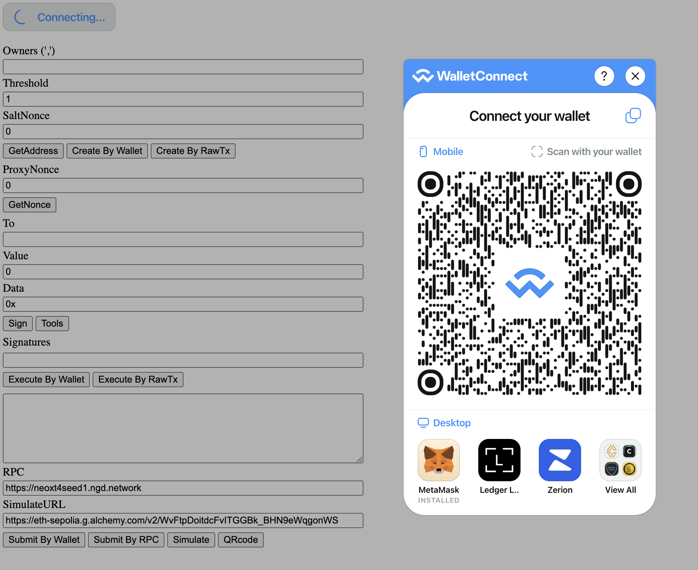
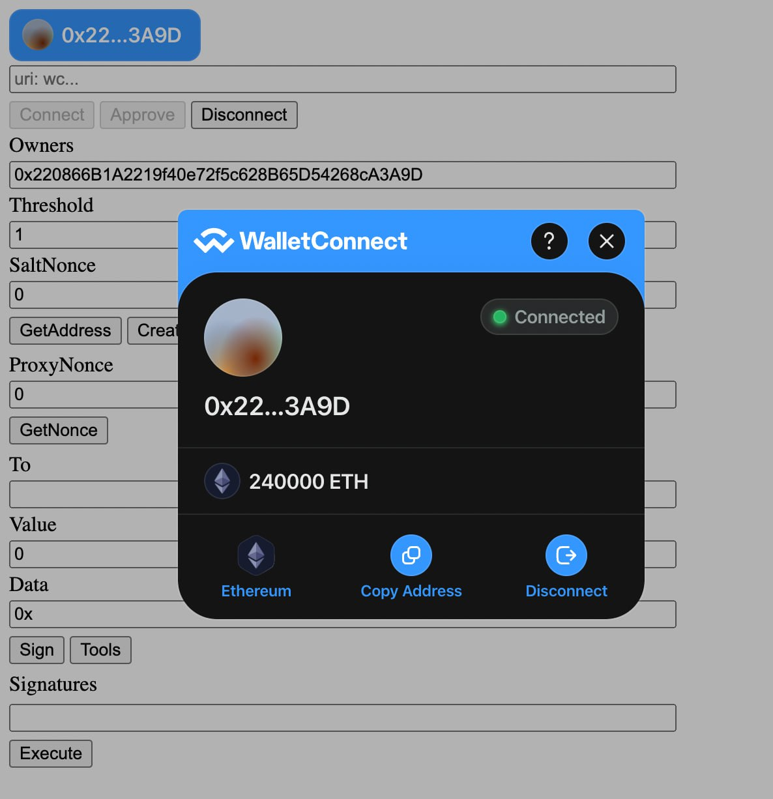

# Responsive Safe Wallet Interface

Siyi Xu, 26th Aug 2024

## Introduction

Ethereum smart contract wallet interface implemented using JavaScript, Ethers.js, and Web3Modal. The application allows users to create and manage multisig wallets, sign transactions, and interact with the Ethereum blockchain. This report also includes suggested technical improvements to enhance the application's functionality, security, and user experience.

## Code structure and Brief Review

|  |  |
The code is structured into several parts:

* HTML Elements: Provides the user interface for interacting with the JavaScript functions.
* JavaScript Code: Implements the core functionality using Ethers.js and Web3Modal libraries.
* Utility Functions: Helper functions to facilitate interaction with the blockchain.
* Event Listeners: Functions triggered by user actions to perform blockchain operations.
* 

## Improvement and further function development

[Git Repo Link(for technical improvements)]()